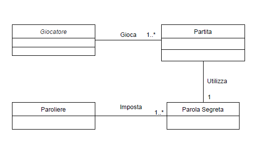
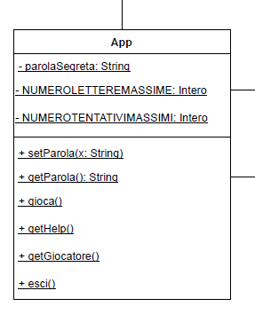
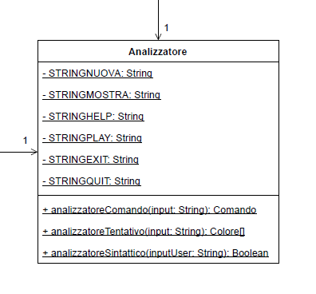
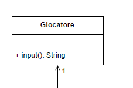
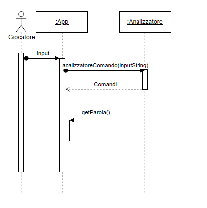
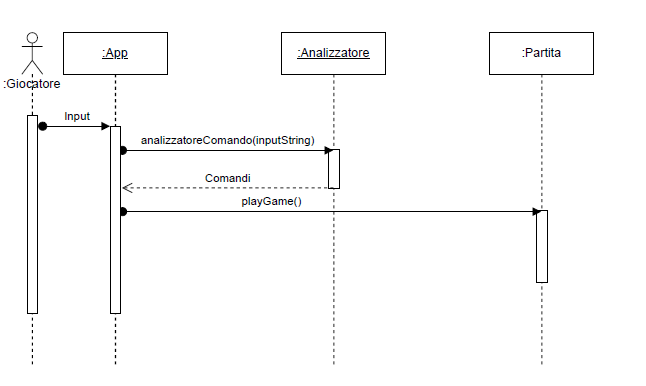
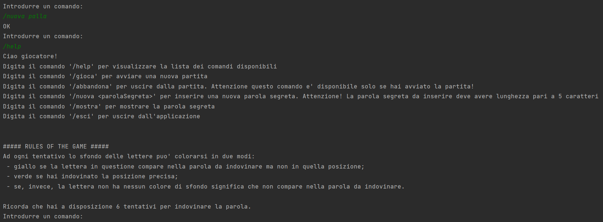

# Report

## Indice
- [1. Introduzione](#introduzione)
- [2. Modello di dominio](#il-modello-di-dominio)
- [3. Requisiti specifici](#requisiti-specifici)
    - [3.1 Requisiti funzionali](#requisiti-funzionali)
    - [3.2 Requisiti non funzionali](#requisiti-non-funzionali)
- [4. System Design](#system-design)
    - [4.1 Stile architetturale adottato](#design-architettura)
    - [4.2 Diagramma dei package, diagramma dei componenti](#design-diagramma)
    - [4.2 Commentare le decisioni prese](#decisioni-prese)
- [5. OO Design](#oo-design)
    - [5.1 Diagrammi delle classi](#diagrammi-delle-classi)
    - [5.2 Diagrammi di sequenza](#diagrammi-di-sequenza)
    - [5.3 Design pattern](#design-pattern)
    - [5.4 Commenti decisioni prese](#design-pattern)
- [6. Manuale utente](#manuale-utente)
- [7. Riepilogo del test](#riepilogo-test)
- [8. Processo di sviluppo e organizzazione del lavoro](#processo-organizzazione)
- [9. Analisi retrospettiva](#analisi-retrospettiva)

## **Introduzione**
___

Wordle è un gioco in cui, il giocatore ha un numero limitato di tentativi - solitamente 6 - per indovinare una parola, con un feedback fornito, per ogni tentativo effettuato, sotto forma di variazione di colore che indica con il colore verde che una lettera è nella posizione giusta, con il colore giallo che la lettera appartiene alla parola segreta, ma in una posizione diversa, e con il colore grigio che la lettera non appartiene alla parola segreta.

L'applicativo è una versione semplificata che rispetta specifici requisiti funzionali.

## **Il modello di dominio**
___

  

## **Requisiti specifici**
___

### **Requisiti funzionali**

- Come paroliere voglio impostare una parola segreta manualmente.

        Al comando /nuova <parola>
        l’applicazione risponde:

        · Parola segreta troppo corta se i caratteri sono inferiori a quelli del gioco

        · Parola segreta troppo lunga se i caratteri sono superiori a quelli del gioco

        · Parola segreta non valida se ci sono caratteri che non corrispondono a lettere dell’alfabeto 
        
        altrimenti l’applicazione risponde con OK e memorizza la parola fino a chiusura applicazione.
        È possibile cambiare la parola durante una sessione di gioco anche senza uscire dall’applicazione.

- Come paroliere voglio mostrare la parola segreta.

        Al comando /mostra
        l’applicazione risponde visualizzando la parola segreta.

- Come giocatore voglio mostrare l'help con elenco comandi.

        Al comando /help o invocando l'app con flag --help o -h
        il risultato è una descrizione concisa, che normalmente appare all'avvio del programma, seguita dalla lista di comandi disponibili, uno per riga, come da esempio successivo:

        · gioca
        · esci
        · ...

- Come giocatore voglio iniziare una nuova partita.

        Al comando /gioca
        se nessuna partita è in corso l'app mostra la matrice dei tentativi vuota, ma senza mostrare la tastiera, e si predispone a ricevere il primo tentativo o altri comandi

- Come giocatore voglio abbandonare la partita.

        Al comando /abbandona
        l'app chiede conferma

        · se la conferma è positiva, l'app comunica l’abbandono
        · se la conferma è negativa, l'app si predispone a ricevere un altro tentativo o altri comandi

- Come giocatore voglio chiudere il gioco.

        Al comando /esci
        l'applicazione chiede conferma

        · se la conferma è positiva, l'app si chiude restituendo un zero exit code
        · se la conferma è negativa, l'app si predispone a ricevere nuovi tentativi o comandi

- Come giocatore voglio effettuare un tentativo per indovinare la parola segreta.

        Digitando caratteri sulla tastiera e invio

        l’applicazione risponde:

        · Tentativo incompleto se i caratteri sono inferiori a quelli della parola segreta
        · Tentativo eccessivo se i caratteri sono superiori a quelli della parola segreta
        · Tentativo non valido se ci sono caratteri che non corrispondono a lettere dell’alfabeto

        altrimenti riempiendo la prima riga libera della matrice dei tentativi con i caratteri inseriti e colorando lo sfondo di verde se la lettera è nella parola segreta
        e nel posto giusto, di giallo se la lettera è nella parola segreta ma nel posto sbagliato e di grigio se la lettera non è nella parola segreta.

        Se le lettere sono tutte verdi l’applicazione risponde

        · Parola segreta indovinata Numero tentativi: <…> e si predispone a nuovi comandi

        Se il tentativo fallito è l’ultimo possibile , l’applicazione risponde

        · Hai raggiunto il numero massimo di tentativi. La parola segreta è <…> e si predispone a nuovi comandi

        Se la parola segreta non è stata impostata l’applicazione risponde
        Parola segreta mancante

### **Requisiti non funzionali**

Elenco dei terminali supportati:
- **Linux:**
    - terminal
- **Mac OS:**
    - terminal
- **Windows:**
    - terminal
    - terminal sottosistema windows per linux (*Windows 10 versione 2004 e successiva*)
    - git bash

Dopo aver eseguito il comando docker pull copiandolo da GitHub Packages, il successivo comando Docker da usare per eseguire il container contenente l'applicazione e':

    docker run --rm -it docker.pkg.github.com/softeng2122-inf-uniba/progetto2122-dijkstra/wordle-dijkstra:latest

Per chi utilizza Git Bash (*Versione 2.36.1*), il comando Docket per eseguire il container dell'applicazione e':

    winpty docker run --rm -it docker.pkg.github.com/softeng2122-inf-uniba/progetto2122-dijkstra/wordle-dijkstra:latest

Per chi utilizza il terminale Windows per visualizzare correttamente i caratteri UTF-8, utilizzare il comando:

    chcp 65001

## **System Design**
___
Il *System Design* viene principalmente adottato nella progettazione di software di alto livello e consiste nell'identificazione dei principali componenti e delle relazioni tra questi.  
Solitamente, l'architettura di un software deve essere definita nella prima fase di progettazione (inizio fase Sprint 1), ma il nostro Team non ha ritenuto importante applicare uno stile architetturale ben preciso. 

Di conseguenza non c'è stato alcun modo di rappresentarlo e difatto non è stato necessario realizzare nessun diagramma a tale scopo.
Nonostante l'assenza di tutto ciò, si è comunque seguito lo stile di un sistema software robusto e di facile comprensione.  
Infine, si è cercato di rispettare i 4 principi sui cambiamenti ideali, applicando appieno il **principio di Information Hiding**.

## **OO Design**

___
### **Diagrammi delle classi**

### **La classe APP**

La classe **App** implementa le seguenti user story:
- Come paroliere voglio impostare una parola segreta manualmente.
- Come paroliere voglio mostrare la parola segreta.
- Come giocatore voglio mostrare l'help con elenco comandi.
- Come giocatore voglio iniziare una nuova partita.
- Come giocatore voglio chiudere il gioco.

    
### **La classe Partita**

    
La classe **Partita** implementa le seguenti user story:
- Come giocatore voglio abbandonare la partita.
- Come giocatore voglio effettuare un tentativo per indovinare la parola segreta.

La classe **Analizzatore** implementa i controlli necessari sull'input inserito dall'utente.

La classe **Giocatore** identifica i permessi del giocatore.

___
### **Diagrammi di sequenza**

- **Diagramma di sequenza di 'Come paroliere voglio impostare una parola segreta manualmente'**

    

- **Diagramma di sequenza di 'Come paroliere voglio mostrare la parola segreta'**

    

- **Diagramma di sequenza di 'Come giocatore voglio mostrare l'help con elenco comandi'**

    

- **Diagramma di sequenza di 'Come giocatore voglio iniziare una nuova partita'**

    

- **Diagramma di sequenza di 'Come giocatore voglio abbandonare la partita'**

    

- **Diagramma di sequenza di 'Come giocatore voglio chiudere il gioco'**

    

- **Diagramma di sequenza di 'Come giocatore voglio effettuare un tentativo per indovinare la parola segreta'**

    

___
### **Design pattern**

Le principali componenti che sono stati individuate sono:
 - classe Giocatore
 - classe Gioco
 - classe Partita

Un giocatore che si interfaccia con il gioco avrà la possibilità di dare in input dei comandi per ricevere informazioni sul gioco o poter avviare una partita. All’interno del gioco è definita la parola segreta utile per il confronto dei tentativi effettuati all’interno della partita. Il giocatore, avviata la partità, avrà la possibilità di inserire comandi - i quali hanno prefisso ‘/’ - e tentativi. Ogni input che viene effettuato dall’utente - tentativo o comando che sia - passa da un analizzatore per verificare la correttezza sintattica e/o per la verifica dell’esistenza del comando inserito.

___
### **Commenti decisioni prese**

Abbiamo fatto in modo che ogni componenente custodisca al proprio interno i propri attributi e metodi, rendendo pubblici solo i membri, operazioni e attributi strettamente necessari, che offrono un servizio - principio di **information hiding**.

Ogni componente del sistema è ad alta coesione, con un obbiettivo e una responsabilità ben definita. Dunque ogni classe è facile da comprendere, da utilizzare ed eventuali modifiche non impatteranno sulle altre classi. Da cui deriva un **basso grado di accoppiamento** / dipendenza tra componenti diversi.

# **Manuale Utente**
Wordle è un web-puzzle che consiste nel richiedere al giocatore di indovinare una parola segreta di cinque lettere avendo a disposizione sei tentativi.

**Come funziona?**  

**1.** Il gioco si avvia con una frase di Benvenuto, seguita da un invito all'utente di digitare il comando   
*'/help'* per avere la lista dei comandi disponibili.

E' possibile avviare il gioco anche da linea di comando attraverso i comandi *'-h'* / *'--help'*  (wordle.jar --help / wordle.jar -h)). Verrà visualizzata direttamente la lista dei comandi.

**2.** Il comando *'/gioca'* permette di avviare il gioco soltanto se la parola segreta da indovinare è stata precedentemente impostata.

In caso contrario, viene visualizzato un messaggio d'errore che avvisa l'utente della mancanza della parola segreta.

**3.** Con il comando *'/nuova parolaSegreta'* è possibile impostare la parola da indovinare, la quale può avere una lunghezza massima pari a cinque caratteri.  
Se la lunghezza della parola non soddisfa i requisiti verranno visualizzati i messaggi di errore di:

- parola troppo corta o parola troppo lunga;

   

- parola non valida se contiene caratteri non corrispondenti alle lettere  dell'alfabeto.

    

**4.**  E' possibile visualizzare la parola segreta impostata prima dell'inizio di una partita:

oppure una volta terminata la sessione di gioco attraverso il comando *'/mostra'*:

E' ovvio che la parola non può essere visualizzata durante la partita in corso!

**5.** Per entrare finalmente nel vivo del gioco è necessario digitare il comando *'/gioca'* e iniziare a digitare i sei tentativi massimi che si hanno a disposizione.  
Una volta avviata la partita, viene inizialmente visualizzata la griglia dei tentativi vuota che man mano si popolerà dei tentativi immessi dall'utente.

**6** Ad ogni tentativo le lettere del tentativo inserito dall'utente avranno un diverso colore di sfondo (verde o giallo) a seconda della loro presenza all’interno della parola segreta: 
- se ha sfondo verde significa che la lettera immessa dell'utente è corretta e che si trova nel posto giusto rispetto alla parola segreta da indovinare;
- se, invece, ha sfondo giallo vuol dire che tale lettera fa parte della parola segreta ma si trova nel posto sbagliato;
- se, infine, una lettera non ha nessun colore di sfondo significa che non fa parte della parola segreta impostata e pertanto non è da digitare nei tentativi successivi.

Una volta indovinata la parola verrà visualizzato un messaggio che attesti la vittoria e la sessione di gioco in corso verrà chiusa.

**7.** E' possibile abbandonare la partita durante la sessione di gioco attraverso il comando *'/abbandona'*.

**8.** Il comando *'/esci'* consente l'uscita dall'applicazione in quattro casi:
- una volta terminata la partita;

    

- durante la sessione di gioco;

    

- prima di iniziare il gioco;

    

- anche all'avvio del programma e prima di impostare la parola segreta;

    

**9.** Infine con il comando *'/help'* è possibile richiamare l'help dei comandi in qualsiasi momento:
- prima di iniziare il gioco:

    

- durante la sessione di gioco:

    

- una volta terminata la partita:

    

## **Riepilogo Test**
___
I casi di test effettuati non sono altro che la descrizione delle attività necessarie per confrontare un comportamento aspettato con quello osservato. 

Sono stati selezionati i casi di test che approssimano un caso ideale, cercando il giusto compromesso tra il numero dei casi dei test e il numero di malfunzionamenti e definendo i criteri di accettazione, in particolare il criterio di copertura definito come obbiettivo pari al 90% per ciascuna classe. 

I casi di test selezionati sono di tipo Black Box, ossia selezioanti esclusivamente dalle specifiche.

### **Badge Coveralls**
    

### **Badge Jacoco**
    

## **Analisi retrospettiva**
___

 

